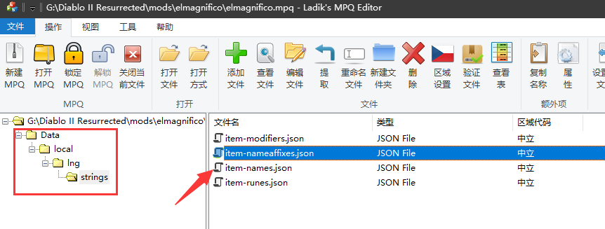

# Only For Chinese and Traditional Chinese

The filter only for Chinese and Traditional Chinese, i didn't change it for other language.Maybe you could modify it for you own.


I know someone write one for English, maybe you could try it.

> https://github.com/AlexisEvo/d2r-loot-filter

More questions just Issue or mail me.


# 显示mod使用说明

**如果你要用显示比较大的，请用群里的test，那个版本物品都比较大**

- **先说，风险自负，出任何问题和我无关，认为会被封什么的请勿使用，我只是替换了文本显示，不包含任何非法hook，使用的也是官方接口**

- 其他所有mod都没有正确处理单纯的宝石词缀导致实际纯宝石掉落没有高亮，因此剔除其他mod

  

elmagnifico显示mod由我本人维护，其他mod由网上搜集而来，更新会第一时间发布在群内，交流群号941746977


elmagnifico，可以显示符文编号、装备是扩展还是精英，同时还能显示浮动数值范围、显示一些注释、药品区分颜色显示，同时具备以上所有功能，并且**精简部分部分词缀**，去掉很多装备的额外英文，方便大量装备显示


## 核心显示原则

1. 尽量缩小每个物品的显示大小
2. 尽量不影响新手游戏
3. 保证在开启物品显示的情况，也能正常走路操作，不影响走位
4. 值得捡的要么高亮，要么有特殊词缀
5. 不需要替换文本的地方，尽量保持原样（重置版的原翻译）


由于可使用颜色一共就13种，为了防止干扰，尽量不使用游戏本身的掉落颜色

- **红1，可以捡**

- **橙黄8，值得捡**
- **紫11，必捡**
- 浅绿12，容易混淆，暂时没用
- 深绿10，容易混淆，暂时没用
- 淡暗金7，容易混淆，暂时没用
- 黑色6，会导致看不清


## 显示效果


## 缩写解释

- 轻、中、重，是指装备重量
- 扩、精，是指扩展级装备、精英级装备，普通装备则不带有该后缀
- 超级法力和生命，瞬回药剂特殊颜色显示
- 所有宝石及以上亮黄色高亮显示，缩短宝石名称
- 所有碎裂宝石红色显示
- 红，生命回复类药水
- 蓝，法力回复类药水
- 紫，生命和法力瞬回类药水
- 掉落金币，移除金币两字，直接显示数字
- 装备的*表示较好底材，值得留意
- 所有护符紫色显示，**会影响到暗金护符掉落颜色**
- 移除原mod自带字体，使用重制版字体
- 各种药剂名称缩短，只保留前两个字符
- 传送卷和鉴定卷名称缩短

还有更多需要私聊我吧，慢慢改进。


## 安装

mod解压到暗黑2重置的目录中


游戏设置中选择额外命令行，加载mod


命令如下：

```
-mod elmagnifico
```


退出游戏重进即可，不需要的话直接去掉命令行就行了，文件删不删无所谓。


## log

2021.10.09，增加*号显示，缩短原版的精扩字符、药剂名称缩短、回城和鉴定卷轴名称缩短

2021.10.10早，修复部分物品依然带有英文，修改碎、裂宝石颜色，修复无情前缀装备变色、取消超蓝颜色显示

2021.10.10晚，补充暗金吐槽，移除部分英文，增加法师铠甲*，删除部分词缀后的英文，区分碎和裂的宝石


## 开源仓库

我的仓库地址，懂的话，你可以自己fork，自己修改

> https://github.com/elmagnificogi/diablo2_resurrected_filter


## 简易修改教程

首先你需要下一个MPQEditor，用来修改MPQ文件

> http://www.zezula.net/en/mpq/download.html

然后打开任何一个要修改mpq，然后就能看到对应的文件了



里面的json使用任何一种编辑器进行编辑即可，但是这里要注意一下，mpq本身编辑以后，是在本地编辑的，不是里面的打包文件被修改了。

要完成打包，需要先删除里面的文件，然后再添加刚才修改的文件进去

显示字体的颜色，是通过加载一个颜色地址数组来实现的，具体地址就是`ÿc`后面跟0-12表示各种颜色

但是由于是十六进制的所以10，11，12显示出来就是 `: ; <` 了

```
ÿc0 （由于默认是白色，所以这个不会有人用）
ÿc1
ÿc2
ÿc3
ÿc4
ÿc5
ÿc6
ÿc7
ÿc8
ÿc9
ÿc:
ÿc;
ÿc<
```

对应下图种的13种颜色


- 需要注意在文本中`[]`中括号是一个特殊字符，他不能直接用来显示


修改的json文件需要放在下面的目录中

```
Data\local\lng\strings\
```


修改字体文件需要放置在以下目录：

```
Data\hd\ui\fonts\
```

- 由于大部分字体不支持繁体，所以可能你替换了字体也无效


## Ref

我的blog文章 

> http://elmagnifico.tech/2021/10/10/diablo2-resurrected-filter/
>
> https://d2mods.info/forum/viewtopic.php?t=57429
